# Proposta de Arquitetura — MVP Clip Generator (IA)

Baseado na análise competitiva do StreamLadder e do PlaySquad. Escopo do MVP:
o núcleo comum aos dois produtos — transformar um vídeo longo (VOD ou upload)
em clipes verticais prontos para TikTok/Reels/Shorts, com corte automático por
IA, reframe vertical e legenda embutida.

Fora de escopo no MVP: publicação automática em redes sociais, sistema de
créditos completo, Trend Scanner, Audio Lab/voice cloning, Academy — esses
ficam para fases seguintes.

## Fluxo de ponta a ponta

```mermaid
flowchart LR
    A[Usuário cola URL do VOD\nou faz upload] --> B[API]
    B --> C[Fila de Jobs\nRedis + Celery]
    C --> D[Worker: Fetch Source\nyt-dlp / upload direto]
    D --> E[Worker: Transcrição\nfaster-whisper]
    E --> F[Worker: Highlight Scoring\nLLM sobre a transcrição]
    F --> G[Worker: Corte + Reframe\nffmpeg + tracking de rosto]
    G --> H[Worker: Legenda\nqueima .srt no vídeo]
    H --> I[Storage\nCloudflare R2]
    I --> J[Usuário baixa/visualiza\nos clipes prontos]
```

## Componentes

### Frontend
- Next.js + Tailwind
- Telas: login, novo projeto (colar URL ou upload), acompanhamento de status
  do job, página do clipe com preview e download
- Status em tempo real via polling simples (SSE/WebSocket depois, se
  necessário)

### Backend API
- Python + FastAPI (mesma linguagem dos workers de IA/vídeo, reduz fricção
  de manter duas stacks)
- Responsabilidades: auth, CRUD de projetos/jobs/clipes, enfileirar jobs,
  gerar URLs assinadas de storage

### Fila de processamento assíncrono
- Redis + Celery
- Cada etapa do pipeline é uma task separada e idempotente/retryable:
  fetch-source → transcribe → score-highlights → render-clip → burn-caption

### Pipeline de vídeo (workers)
1. **Fetch source**: `yt-dlp` baixa o VOD (Twitch/YouTube/Kick) ou usa o
   arquivo enviado direto
2. **Transcrição**: `faster-whisper` (self-hosted) gera transcript com
   timestamps
3. **Highlight scoring**: chama um LLM (Claude API) com a transcrição para
   sugerir N trechos (start/end + motivo do corte)
4. **Corte + reframe**: `ffmpeg` corta o trecho; reframe vertical via
   detecção de rosto/pessoa (mediapipe ou YOLO) com crop dinâmico por cena —
   fallback simples: crop central fixo
5. **Legenda**: gera `.srt` do trecho e queima no vídeo (estilo legenda
   estilo TikTok)
6. Upload do resultado para o storage e atualização do status do job

### Armazenamento e dados
- Object storage: Cloudflare R2 (custo de egress menor que S3)
- Postgres para metadados

Modelo simplificado:
- `User(id, email, plan, credits)`
- `Project(id, user_id, source_url|source_file, status)`
- `Job(id, project_id, stage, status, error)`
- `Clip(id, project_id, start, end, video_url, caption_srt, score, reason)`

### Infra
- Docker para API e workers
- Workers em CPU no MVP (GPU é otimização futura para whisper/tracking)
- Deploy inicial em Fly.io ou Railway — evitar Kubernetes nesta fase

### Billing (mínimo pro MVP)
- Free tier com limite de minutos/clipes por mês
- Stripe Checkout para upgrade de plano — sistema de créditos completo
  (como no PlaySquad) fica para a fase 2

## Stack resumida
| Camada | Escolha |
|---|---|
| Frontend | Next.js + Tailwind |
| Backend/workers | Python (FastAPI + Celery) |
| Fila | Redis |
| Banco | Postgres |
| Storage | Cloudflare R2 |
| Vídeo/IA | ffmpeg, yt-dlp, faster-whisper, mediapipe/YOLO |
| IA de highlight/legenda | Claude API |
| Billing | Stripe |
| Deploy | Docker + Fly.io/Railway |

## Riscos e pontos de atenção
- `yt-dlp` quebra periodicamente quando Twitch/YouTube mudam a plataforma —
  exige manutenção contínua
- Reframe com tracking de qualidade alta pode exigir GPU; validar se um crop
  central simples já resolve a maioria dos casos antes de investir nisso
- APIs de publicação (TikTok/Instagram) têm processo de aprovação de app
  demorado — por isso ficam fora do MVP
- Direitos autorais de clipes de terceiros: mesma zona cinzenta em que os
  concorrentes operam hoje; vale considerar antes de escalar

## Roadmap por fases
1. **MVP**: loop completo de clipagem automática descrito acima, sem
   publicação nem créditos
2. **Fase 2**: billing com créditos, contas de redes sociais conectadas,
   publicação direta (equivalente ao Content Publisher)
3. **Fase 3**: analytics de performance dos clipes, Trend Scanner, Channel
   Analyzer
4. **Fase 4**: módulos extras (Audio Lab/voice cloning, thumbnail analyzer,
   Academy)
